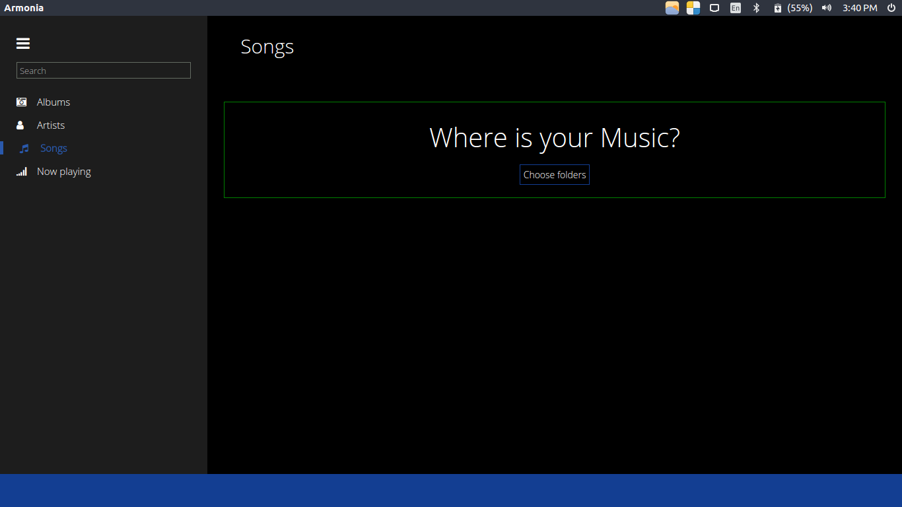
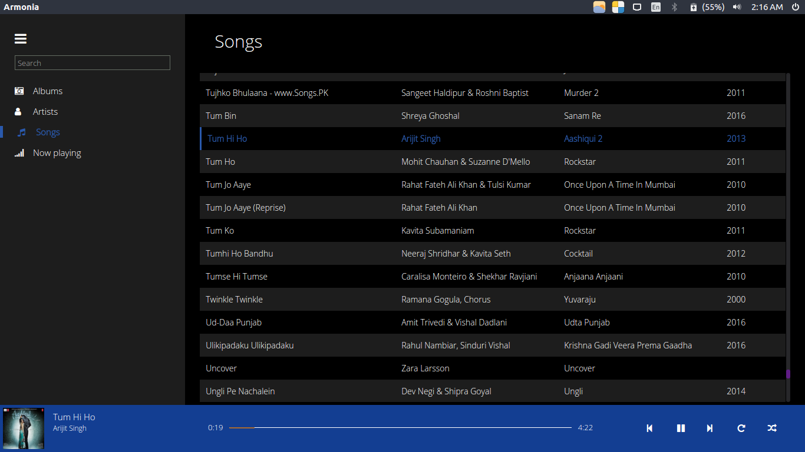

# THIS PROJECT IS ABANDONED AS IT IS BEING DEVELOPED USING ANGULAR 2 FRAMEWORK [HERE](https://github.com/prashanth-nani/armonia)

# Armonia

**A Cross platform music player.**
Built upon github's electron.

_Note:  This product is currently under development. Visit [wiki](https://github.com/prashanth-nani/armonia/wiki/Armonia) for the current status of the project._

===

### Installation

Releases can be found [here](https://github.com/prashanth-nani/armonia/releases). Please note that these are only portable versions. Installers will be provided once the remaining features are implemented.

===

### Troubleshooting

Armonia is currently in development. This implies some things can break after an update (database schemes changes, config...).

If you encounter freezes when starting the app, you can reset Armonia by following these steps:

- Go to the Armonia folder directory
    - Windows: `%AppData%\Armonia`
    - OSX: `~/Library/Application Support/Armonia`
    - Linux: `~/.config/Armonia/` or `$XDG_CONFIG_HOME/Armonia`
- Delete:
    - `Armonia.db` file
    - `config.json` file
    - `resources` folder
- Restart Armonia

If you still get problems after that, please open an issue :)

===

### Screenshots





_Note_: UI is inspired from Windows Groove music

===

### Development
#### How to run
- Install git
- Clone repository
- Install node >= 7.2.1
- Install npm >= 3.10.10
- Run the following commands
```bash
cd armonia
npm install
npm run compile
npm start
```

===

### Packaging
Packaging for 64 bit:
- Run
```bash
npm install electron-packager -g
cd armonia
# linux:
electron-packager . --arch=x64 --platform=linux --asar=true --prune --overwrite

#Windows (Build on a windows machine):
npm install electron-rebuild --save-dev
node_modules\.bin\electron-rebuild
electron-packager . --arch=x64 --platform=win32 --asar=true --prune --overwrite
```

===
