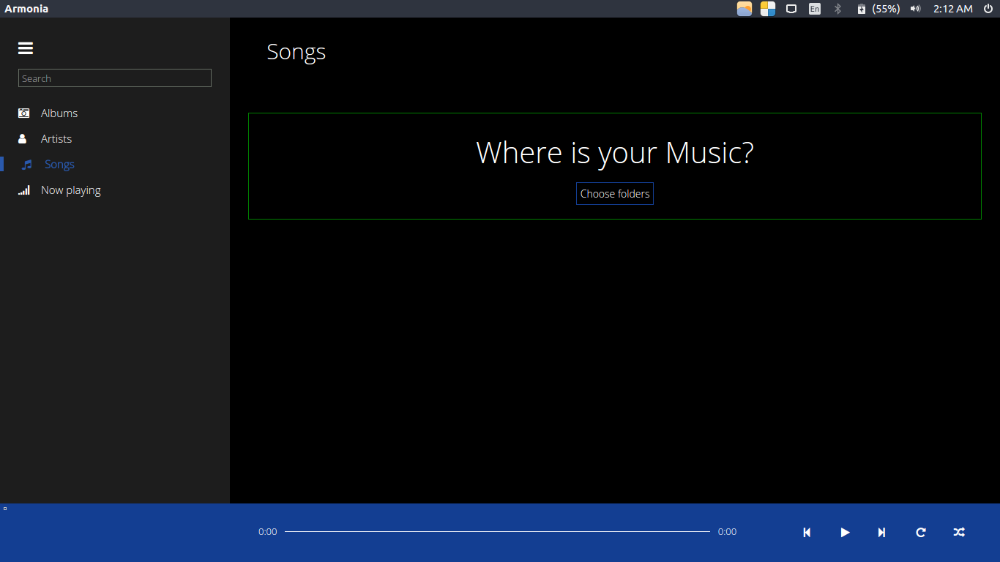

# Armonia (Under Development)

**A Cross platformed music player.**
Built upon github's electron.

## Implemented:
- Songs Section
- Play Button
- Album Art
- Progress bar

## To be implemented:
- Playlists
- Other controls (Previous, next, repeat, shuffle)
- Settings
- Auto detect new music files on app restart
- Search
- Remaining sections on the sidebar
- Control with Music keys
- Themes
- Music tag editing

## Screenshots:



## Development:
### How to run
- Install git
- Clone repository
- Install node >= 7.2.1
- Install npm >= 3.10.10
- Run the following commands
```bash
cd armonia
npm install
npm run compile
npm start
```
### Packaging
Packaging for linux 64 bit:
- Run
```bash
npm install electron-packager -g
cd armonia
electron-packager . --arch=x64 --platform=linux --prune --overwrite
```

#### License [MIT License](LICENSE.md)
